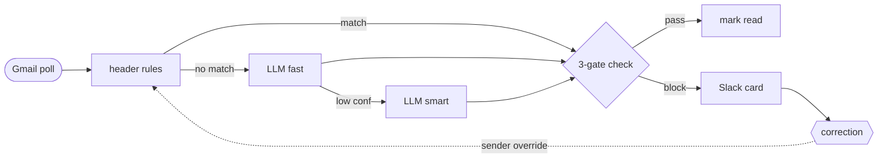

# 📬 Mail agent

[](https://docs.python.org/3/)
[](#tests)
[](#)
[](LICENSE)

A self-hosted Gmail triage agent that classifies every unread message into `ignore`, `notify`, or `respond` using deterministic header rules first and an LLM fallback only on the residue. Acts on the decision — silent archive, Slack digest, or realtime DM — with all data staying on your machine except LLM calls (~$1/month).

---

- [Getting started](#getting-started)
- [How it works](#how-it-works)
- [Slack cards](#slack-cards)
- [Configuration](#configuration)
- [CLI](#cli)
- [Tests](#tests)

---

## Getting started

Prerequisites: [`uv`](https://docs.astral.sh/uv/), an Anthropic API key, a Google Cloud OAuth Desktop client, and a Slack app in Socket Mode.

```bash
git clone https://github.com/polurezov8/mail-agent.git mail-agent
cd mail-agent
uv sync
uv run mail-agent triage --mock   # smoke test, no credentials needed
```

> [!Note]
> Prefer a guided setup? `uv run mail-agent init` walks through all four steps below interactively.

### Connect Gmail

1. [Google Cloud Console](https://console.cloud.google.com/apis/credentials) → Credentials → **OAuth Desktop client** → Download JSON.
2. `mkdir -p creds && chmod 700 creds`
3. `mv ~/Downloads/client_secret_*.json creds/personal_credentials.json && chmod 600 creds/personal_credentials.json`
4. `cp .env.example .env && chmod 600 .env` — fill `ANTHROPIC_API_KEY` and `GMAIL_ACCOUNTS=personal`
5. `uv run mail-agent setup-gmail`

### Connect Slack

1. Create a Slack app (Socket Mode). Grab the bot token (`xoxb-…`), app token (`xapp-…`), and your member ID.
2. Add them to `.env`: `SLACK_BOT_TOKEN`, `SLACK_APP_TOKEN`, `SLACK_USER_ID`.
3. `uv run mail-agent slack test`

### Run unattended

```bash
uv run mail-agent doctor            # end-to-end health check
uv run mail-agent schedule install  # launchd (macOS) or systemd (Linux)
```

### Add a second Gmail account

1. Edit `.env`: change `GMAIL_ACCOUNTS=personal` to `GMAIL_ACCOUNTS=personal,work`.
2. Download an OAuth Desktop client JSON for the second account, save as `creds/work_credentials.json`.
3. `uv run mail-agent setup-gmail`

```bash
uv run mail-agent triage --account work   # target one inbox
uv run mail-agent list-accounts           # verify both are authorized
```

Slack cards show `📬 work` / `📬 personal` badges when two or more accounts are active.

---

## How it works

Every unread message passes through two stages:

**Header rules** match on sender domain, email address, or presence of a header (e.g. `List-Unsubscribe`). No LLM call. A matching rule assigns a bucket and optionally auto-marks as read.

**LLM fallback** handles anything that didn't match. Claude Haiku classifies first; low-confidence results escalate to Claude Sonnet. Natural-language rules in `config/rules.yaml` guide the decision.

| Bucket | Action |
|---|---|
| `ignore` | Auto-mark as read if confidence ≥ 0.85 and the classifier opts in (header rule, LLM judgment, or user override). Otherwise surfaces as uncertain. |
| `notify` | Batched into the next Slack digest. |
| `respond` | Posted to Slack immediately as a single card. |

Auto-marking requires all three gates: bucket is `ignore`, the classifier opts in via `auto_mark`, and confidence meets the floor. Header rules opt in via `auto_mark_read: true`; the LLM opts in for unambiguous low-signal mail or when natural-language rules say so; user sender overrides to `ignore` opt in implicitly. A miss at any gate surfaces the item.



Corrections from the "Wrong bucket" flow write a sender-level override active on the next triage run. Thread context (prior messages in the same Gmail thread) is passed to the LLM for better accuracy on `respond` vs `notify` decisions.

---

## Slack cards

Two card types are posted to your DM.

**Singleton** — one item. First line: sender name and cleaned subject. Second line: cleaned snippet. Metadata line: account · age · bucket · confidence. Actions: **Mark read** (primary for `notify`/`ignore`) or **Open in Gmail** (primary for `respond`), plus the other as secondary, plus a `⋮` overflow with **Wrong bucket**.

**Grouped** — two or more items with the same normalized subject (e.g. four calendar declines for the same meeting). Shows a summary header, a bullet list of individual sender snippets each with a direct Gmail link, then **Mark all read (N)** · **Open latest** · `⋮` overflow. Clicking **Mark all read** marks only that group's messages and leaves other rows in the same digest untouched.

Text is cleaned before display:

| Raw Gmail content | Displayed as |
|---|---|
| `Updated invitation: Meeting @ Tue May 26, 2026 12pm–1:20pm (EEST) (Name)` | `Meeting` |
| `Declined: Meeting (Name)` | `Declined: Meeting` |
| Snippet with `Join with Google Meet … Meeting link … Join by` | Boilerplate stripped; decline note surfaced as `Declined — "…"` |
| Model ID (`claude-haiku-4-5-…`) | `LLM` · `Rule` · `User` |

**Wrong bucket** opens a modal. Check "Apply to all future mail from this sender" to write a persistent sender-level override.

---

## Configuration

`config/rules.yaml` is the single source of truth.

```yaml
rules:                     # evaluated in order; first match wins
  - name: github_notifications
    description: GitHub notification emails
    match:
      from_domain: [github.com]
    bucket: ignore
    auto_mark_read: true

llm:
  model_fast: claude-haiku-4-5-20251001
  model_smart: claude-sonnet-4-6
  confidence_threshold: 0.7        # below → escalate fast → smart
  auto_mark_min_confidence: 0.85   # below → never auto-mark
  nl_rules:
    - "Security alerts from Google / Apple / banks → respond."
    - "Mail from a real human asking a direct question → respond."
  redact_pii: false                # opt-in: strip emails/URLs/phones/IBAN/CC before LLM
  redact_names: []                 # opt-in: collapse names to <PERSON_N>, re-hydrate on output
```

Add a rule without editing the file:

```bash
uv run mail-agent rule add "Invoices from vendor@acme.com → respond"
uv run mail-agent rules   # list current rules
```

OAuth scopes: `gmail.modify` (read + remove `UNREAD` label). Never `gmail.send`. All secrets (`.env`, `creds/*.json`, `mail_agent.db`) are `chmod 600` and gitignored.

---

## CLI

```
mail-agent triage [--account NAME] [--mock] [--no-slack] [--dry-run]
mail-agent search <NL query> [--account NAME]
mail-agent brief [--hours N] [--account NAME]
mail-agent stats [day|week|month|all] [--account NAME]
mail-agent status
mail-agent recent [N]
mail-agent review [N]
mail-agent setup-gmail
mail-agent list-accounts
mail-agent doctor
mail-agent schedule install|status|restart|uninstall
mail-agent eval run [--min-bucket-accuracy N]
mail-agent init
```

Slash commands from Slack:

```
/mail                   triage all unread now (async)
/mail brief [hours]     narrative summary of recent activity
/mail search <query>    find mail by natural-language description
/mail recent [N]        last N mark-read audit rows
/mail review [N]        review uncertain auto-marks
/mail rule add "…"      append a natural-language rule
/mail rules             list current rules
/mail corrections list
/mail corrections undo <ID>
/mail help
```

DM the bot any free-text question and the inbox analyst fetches full email bodies, extracts structured data, and replies with a synthesised answer — no slash command needed.

---

## Tests

```bash
uv run pytest -q                                   # 267 tests, ~0.7s
uv run ruff check src tests
uv run mail-agent eval run --min-bucket-accuracy 0.85
```

---

[MIT](LICENSE) — © 2026 Dmytro Poluriezov.
