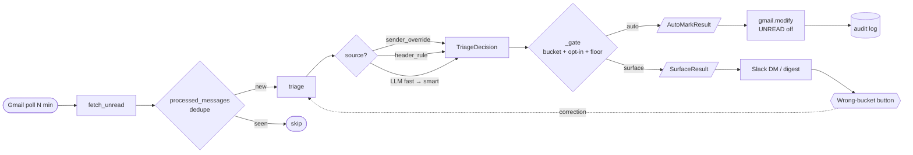

# 📬 mail-agent

> A self-hosted Gmail triage agent that classifies incoming mail, surfaces what matters in Slack, and quietly archives the rest.

Built for zero-inbox practitioners who don't want to ship their reading habits to a third-party SaaS.

[](https://docs.python.org/3/)
[](#-tests)
[](#)

---

## 🎯 What it does

For every unread message in your Gmail inbox, `mail-agent`:

1. **Classifies** it into one of three buckets — `ignore`, `notify`, or `respond` — using a two-stage classifier (deterministic header rules first, then an LLM fallback only on the residue).
2. **Acts** based on the bucket: silent auto-archive for `ignore`, Slack digest for `notify`, real-time Slack DM for `respond`.
3. **Logs** every decision and every write to a local SQLite audit log.
4. **Learns** from one-click corrections in Slack — sender-level overrides feed straight back into the next triage cycle.

Runs unattended via `launchd` (macOS) or `systemd` (Linux). Costs about a dollar a month in LLM calls.

---

## ✨ Highlights

| Area | What you get |
|---|---|
| 🧠 Two-stage classifier | Deterministic header rules + LLM fallback with confidence-based escalation (Haiku → Sonnet). |
| 🛡️ Three-gate safety | Auto-mark requires `bucket == ignore` **and** an opt-in rule **and** confidence ≥ floor. |
| 📣 Tiered Slack delivery | `respond` → realtime DM; `notify` → digest; `ignore` → silent + audit log. |
| 🔁 Interactive feedback | "Wrong bucket?" button on every Slack post → modal → optional sender-level override. |
| 📊 Daily Brief | `/mail brief` summarizes the last 24h: counts, rule hits, surfaced items, uncertain band. |
| 🔍 NL search | `/mail search "anything from Jane last week"` — LLM translates to Gmail operators, hits posted to your DM. |
| 🧵 Thread context | Prior messages in the same Gmail thread are passed to the LLM for better respond/notify accuracy. |
| 📤 Bulk unsubscribe | Parses `List-Unsubscribe-Post` (RFC 8058) and one-clicks senders you've auto-marked as ignore. |
| 🕶️ PII redaction | Opt-in regex redaction of emails, URLs, phones, IBAN, credit-card numbers, **and** named persons. Reasoning re-hydrated for display. |
| 🧪 Eval harness | `mail-agent eval run` scores the classifier against labeled fixtures. Public synthetic set committed; personal set gitignored. |
| 🧱 Type-driven design | Discriminated unions and `NewType` IDs make illegal states unrepresentable (e.g. only `AutoMarkResult` can reach Gmail's modify API). |
| ⏰ Cross-platform scheduler | One scheduler abstraction; `launchd` and `systemd` implementations. `mail-agent schedule install` / `status` / `restart` / `uninstall`. |
| 🩺 Doctor | `mail-agent doctor` runs end-to-end health checks: env vars, file perms, token expiry, Slack auth, DB writable, schedule state. |
| 🔎 Inbox analyst | DM the bot any question — _"how much did I spend on subscriptions last 3 months?"_ — fetches full email bodies, extracts structured data in batches, synthesises a Slack-formatted answer. |
| 🚀 One-shot init | `mail-agent init` walks through `.env`, creds permissions, Gmail OAuth, Slack ping, and doctor in one idempotent wizard. |

---

## 🚀 Quick start

Prerequisites: [`uv`](https://docs.astral.sh/uv/), an Anthropic API key, a Google Cloud OAuth Desktop client, and a Slack app (Socket Mode).

> Prefer one command? `uv run mail-agent init` walks through all four tiers interactively.

### 1. Try it in 60 seconds (no creds)

```bash
git clone https://github.com/polurezov8/mail-agent.git mail-agent
cd mail-agent
uv sync
uv run mail-agent triage --mock
```

### 2. Connect Gmail

1. [Google Cloud Console](https://console.cloud.google.com/apis/credentials) → Credentials → **OAuth Desktop client** → Download JSON.
2. `mkdir -p creds && chmod 700 creds`
3. `mv ~/Downloads/client_secret_*.json creds/personal_credentials.json && chmod 600 creds/personal_credentials.json`
4. `cp .env.example .env && chmod 600 .env` — fill `ANTHROPIC_API_KEY`, `GMAIL_ACCOUNTS=personal`
5. **Verify:** `uv run mail-agent setup-gmail`

### 3. Connect Slack

1. Create a Slack app (Socket Mode); grab Bot, App, and User tokens.
2. Paste into `.env`: `SLACK_BOT_TOKEN`, `SLACK_APP_TOKEN`, `SLACK_USER_ID`.
3. **Verify:** `uv run mail-agent slack test`

### 4. Run unattended

```bash
uv run mail-agent doctor
uv run mail-agent schedule install
```

---

## 💬 Slack commands

```
/mail                       run triage now (async)
/mail status                counters + last-run timestamp
/mail brief [hours]         narrative summary of recent activity
/mail search <NL query>     find mail by natural-language description (metadata)
/mail recent [N]            last N mark-read audit rows
/mail review [N]            review uncertain LLM auto-marks
/mail rule add "..."        append a natural-language rule the LLM applies
/mail rules                 list current rules
/mail corrections list      list user corrections
/mail corrections undo N    soft-undo a sender-level override
/mail help
```

**DM free text** — type any question directly to the bot (_"how much did I spend on subscriptions last 3 months?"_) and the inbox analyst fetches full email bodies, extracts structured data, and posts a synthesised answer. No slash command needed.

Every digest / respond post carries three buttons: **Mark read**, **Open in Gmail**, **Wrong bucket** (opens a modal that records a correction and optionally applies to all future mail from that sender).

---

## 🏗️ Architecture



LangGraph wires the nodes with conditional edges: an empty inbox short-circuits to `report`, no `AutoMarkResult` skips `mark_read`, no `SurfaceResult` (or `--no-slack`) skips `slack_dispatch`.

---

## ⚙️ Configuration

`config/rules.yaml` is the single source of truth.

```yaml
rules:                     # deterministic header rules, evaluated in order
  - name: github_notifications
    description: GitHub notification emails
    match:
      from_domain: [github.com]
    bucket: ignore
    auto_mark_read: true

llm:                       # fallback for anything no rule matches
  model_fast: claude-haiku-4-5-20251001
  model_smart: claude-sonnet-4-6
  confidence_threshold: 0.7         # below this → escalate fast → smart
  auto_mark_min_confidence: 0.85    # below this → never auto-mark (surface instead)
  nl_rules:                         # natural-language rules surfaced to the LLM
    - "Security alerts from Google / Apple / banks → respond. These are time-sensitive."
    - "Mail from a real human asking a direct question → respond."
  redact_pii: false                 # opt-in: redact emails/URLs/phones/IBAN/CC before LLM
  redact_names:                     # opt-in: collapse names to <PERSON_N>, re-hydrate on output
    - "Your Full Name"
```

Use `mail-agent rules wizard` for guided setup, or `mail-agent rules add "..."` to append a single NL rule.

---

## 🔒 Privacy

- All audit data, corrections, and the SQLite DB stay on your machine.
- Only the LLM-fallback path sends content to Anthropic — header-rule hits never leave your machine.
- `redact_pii` + `redact_names` strip sensitive spans from the snippet/subject sent to the LLM and re-hydrate the model's reasoning before display.
- OAuth scopes used: `gmail.modify` (read + remove `UNREAD` label). Never `gmail.send`.
- All files containing secrets (`.env`, `creds/*.json`, `mail_agent.db`) are `chmod 600` and gitignored.

---

## 🛠️ Tech stack

- **Python 3.11+** with [`uv`](https://docs.astral.sh/uv/) for dependency management.
- **LangGraph** for the triage pipeline (conditional edges, type-narrowed routing).
- **LangChain + Anthropic** for the LLM fallback (Claude Haiku 4.5 fast / Sonnet 4.6 smart).
- **Pydantic v2** for every model — discriminated unions, validators, structured LLM output.
- **Slack Bolt (Socket Mode)** for delivery + interactive feedback.
- **SQLite** (stdlib) for processed-ID dedupe, mark-read audit, corrections, unsubscribes.
- **`launchd` / `systemd`** for background scheduling, wrapped by one `Scheduler` Protocol.

---

## 🧪 Tests

```bash
uv run pytest -q                                  # 158 tests, ~0.5s
uv run ruff check src tests
uv run mail-agent eval run --min-bucket-accuracy 0.85
```

---

## 📐 Scope

By design:

- **Triage only** — no drafting, sending, or reply suggestions.
- **Single user** — secrets and rules are per-checkout; no multi-tenant story.
- **Personal use focus** — work-mail integration depends on your org's third-party LLM policy.
- **Sender override is aggressive** — a single correction with the checkbox active applies sender-wide. Undo via `/mail corrections undo`.

---

## 🗺️ Roadmap

Open ideas, not promises:

- 🗂️ Per-account / multi-tenant rule overrides
- 🤖 Optional NER for name redaction beyond the explicit list
- ✍️ Reply drafts on `respond` (gated, draft-only, never auto-send)
- 📈 Long-horizon learning from corrections (rule suggestions)
- 🧪 Broader eval coverage on `respond` / `notify`

---

## 📜 License

[MIT](LICENSE) — © 2026 Dmytro Poluriezov.
